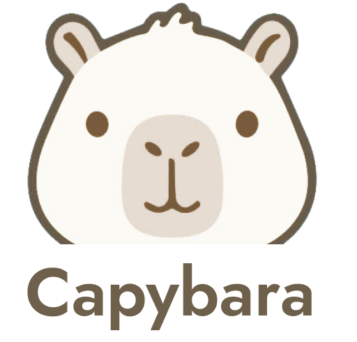

# Capybara

[](https://github.com/Distendo/capybara/actions/workflows/ci.yml)



# Ollama, but much better.

## About

Capybara is a local model runner inspired by Ollama, and much better than Ollama.

It is built to keep the basic workflow simple:

```
capybara pull llama3
capybara run llama3
```

Models run locally on your machine and can also be exposed through an
OpenAI-compatible HTTP API with a built-in web UI.

### What makes it better

- **Open WebUI integration** — one command wires up the full [Open WebUI](https://github.com/open-webui/open-webui) chat frontend (streaming, markdown, multi-chat, RAG, voice) against your local models. No configuration.
- **Hot-swapping models** — switch models through the API or CLI without stopping the server. Requests queue until the swap finishes; clients never see an error.
- **Fast installs** — signed prebuilt llama.cpp binaries for macOS/Linux when available; falls back to compiling for your exact backend otherwise.
- **Honest process management** — PID reuse protection, orphan cleanup, foreign-port detection ("is Ollama running?") instead of cryptic failures.

Under the hood Capybara drives [llama.cpp](https://github.com/ggml-org/llama.cpp)
as its inference engine — you get state-of-the-art GGUF inference with Metal,
CUDA, ROCm, SYCL or Vulkan acceleration without having to touch a single build
flag yourself.

## Install

Build it from source (macOS, Linux and FreeBSD; requires Python 3.9+):

```
git clone https://github.com/Distendo/capybara.git
cd capybara
make build        # or: ./install.sh
```

The installer prefers official prebuilt llama.cpp binaries for your platform
(seconds, not minutes) and only compiles from source when no prebuilt binary
matches your hardware (e.g. CUDA/ROCm/SYCL). It then installs `capybara` /
`capybara-gui` to `~/.local/bin`.

Force a source build of the engine: `CAPYBARA_ENGINE_SOURCE=1 ./install.sh`.
Only need the engine? `make engine` skips CLI setup.

## Usage

| Command | Description |
| --- | --- |
| `capybara pull <model>` | download a model (alias, HF repo, URL or local file) |
| `capybara run <model> [prompt]` | chat interactively, or one-shot with a prompt |
| `capybara list` | list installed models |
| `capybara inspect <model>` | show details about a model (`show` works too) |
| `capybara rm <model>` | remove a model |
| `capybara cp <src> <dst>` | copy a model under a new name |
| `capybara serve [--model M] [-F]` | start the API server (`-F` = foreground) |
| `capybara ui [--model M]` | start the server and open the Open WebUI frontend |
| `capybara ps` | server status |
| `capybara stop` | stop the API server |
| `capybara logs [-n N]` | tail the engine log |
| `capybara create -f Modelfile name` | create a model from a Modelfile |
| `capybara launch <prog> --model M` | run a program wired to the local API |
| `capybara agents` | list supported coding agents + install status |
| `capybara agent <name> [--model M]` | install (if needed) and run a coding agent wired to Capybara |

Running a model that isn't installed pulls it automatically first.

One-shot runs print generation stats:

```
$ capybara run smollm "hi"
Hello! How can I assist you today?
[8 tokens · 0.3s, first token 0.1s · 26.7 tok/s]
```

### Chat commands

Inside `capybara run`:

```
/bye          exit (also /exit, /quit, Ctrl-D)
/clear        reset the conversation
/load <m>     switch to another installed model
/show         show the loaded model's template and parameters
/set system   set a system prompt for this session
"""           start/end a multi-line message
/help         list commands
```

## Models

Pull by alias, Hugging Face repo, exact quantization, direct URL or local path:

```
capybara pull smollm                          # tiny test model (~80 MB)
capybara pull llama3                          # alias -> curated repo + Q4_K_M
capybara pull bartowski/Qwen2.5-7B-Instruct-GGUF:Q4_K_M
capybara pull https://example.com/model.gguf  # direct URL
```

Sharded (multi-part) GGUF releases are detected and downloaded completely.
Quantization defaults to Q4_K_M when a repo offers it.

Built-in aliases:

| Alias | Model |
| --- | --- |
| `smollm` | SmolLM2 135M Instruct (Q2_K) |
| `llama3` | Meta Llama 3 8B Instruct |
| `llama3.1` | Meta Llama 3.1 8B Instruct |
| `qwen2.5` | Qwen 2.5 7B Instruct |
| `mistral` | Mistral 7B Instruct v0.3 |
| `gemma2` | Gemma 2 9B IT |
| `phi3` | Phi-3 mini 4k Instruct |

Model families take size and quantization suffixes — `family[:size][:quant]`:

```
capybara pull qwen3                 # Qwen3 8B (default size)
capybara pull qwen3:0.6b            # smallest Qwen3
capybara pull qwen3:14b:q8_0        # explicit quantization
capybara pull qwen3-coder           # Qwen3 Coder 30B A3B (agentic coding)
capybara pull gpt-oss:20b           # OpenAI open-weight MXFP4
capybara pull gpt-oss:120b          # ... the big one (~65 GB)
capybara pull deepseek-r1:32b       # R1 reasoning distill
capybara pull gemma3:12b            # Gemma 3 (vision-capable builds)
```

Available families: `qwen3`, `qwen3-coder`, `gpt-oss`, `deepseek-r1`,
`llama3.2`, `llama3.3`, `gemma3`, `phi4`, `mistral-nemo`, `devstral`,
`smollm2`. Quantization defaults to Q4_K_M when a repo offers it; sharded
(multi-part) releases are detected and downloaded completely.

List what you have:

```
$ capybara list
NAME                      SIZE      MODIFIED
SmolLM2-135M-Instruct.Q2_K  84.2 MB  2026-08-22 12:40
```

## Coding agents

Capybara wires popular open-source coding agents from GitHub to your local
models — installing any missing tool automatically:

```
capybara agents                     # list supported agents + install status
capybara agent aider                # install if needed, pull its model, run it
capybara agent opencode --model qwen3-coder
capybara agent qwen-code -- --version   # everything after -- goes to the agent
```

| Agent | From | Default model |
| --- | --- | --- |
| `aider` | Aider-AI/aider | qwen3-coder |
| `gptme` | gptme/gptme | qwen3 |
| `open-interpreter` | openinterpreter/interpreter | qwen3 |
| `shell-gpt` | TheR1D/shell_gpt | smollm2 |
| `opencode` | sst/opencode | qwen3-coder |
| `crush` | charmbracelet/crush | qwen3-coder |
| `goose` | block/goose | qwen3 |
| `qwen-code` | QwenLM/qwen-code | qwen3-coder |

Every agent is started with `OPENAI_BASE_URL` / `OPENAI_API_BASE` /
`OPENAI_API_KEY` pointed at Capybara, so it talks to whatever model you
passed instead of a cloud API.

## Web UI (Open WebUI)

Capybara uses [Open WebUI](https://github.com/open-webui/open-webui) as its chat
frontend — the full-featured, self-hosted ChatGPT alternative. One command:

```
capybara ui            # start server + launch Open WebUI wired to it
```

Install Open WebUI once with either:

```
pip install open-webui
```

or Docker:

```
docker run -d --name capybara-webui -p 8080:8080 \
  -e OPENAI_API_BASE_URL=http://host.docker.internal:11434/v1 \
  -e OPENAI_API_KEY=capybara -e WEBUI_AUTH=false \
  --add-host=host.docker.internal:host-gateway \
  -v capybara-webui:/app/backend/data --restart unless-stopped \
  ghcr.io/open-webui/open-webui:main
```

`capybara ui` reuses an Open WebUI that is already running on port 8080,
launches the local one otherwise (first boot can take a minute), and opens
your browser. You get streaming, markdown, conversation history, model
switching and more — all backed by your local Capybara server.

The webui port defaults to 8080; override with `CAPYBARA_WEBUI_PORT`.

## API

Capybara is **Ollama-compatible**. Point any Ollama client at:

```
http://localhost:11434
```

Ollama endpoints:

```
POST /api/chat      chat with a model (NDJSON stream, like Ollama)
POST /api/generate  raw prompt generation (NDJSON stream, like Ollama)
GET  /api/tags      list installed models
POST /api/show      model metadata (modelfile template, parameters)
POST /api/pull      download a model from Hugging Face or the Ollama library
DELETE /api/delete  remove an installed model
GET  /api/ps        currently loaded model + unload timer
```

Requests accept standard Ollama fields (`messages`, `prompt`, `stream`,
`options`, `keep_alive`, `think`). Reasoning models (QwQ, DeepSeek-R1,
ornith, ...) stream their chain of thought in a separate `thinking` field,
exactly like Ollama. The `keep_alive` field controls how long the model
stays loaded after the last request (`"5m"` default; `"90s"`, `"2h"`,
`"-1"` for forever all work). Models are hot-swapped automatically when
you request a different one - no restart needed.

Example:

```bash
curl http://localhost:11434/api/chat -d '{
  "model": "llama3",
  "messages": [{ "role": "user", "content": "Hello" }]
}'
```

The same port also serves an OpenAI-compatible API on:

```
http://localhost:11434/v1
```

Example:

```bash
curl http://localhost:11434/v1/chat/completions \
  -H "Content-Type: application/json" \
  -d '{
    "model": "llama3",
    "messages": [
      {
        "role": "user",
        "content": "Hello"
      }
    ]
  }'
```

It can therefore be used with applications that already support
OpenAI-compatible endpoints. The port also exposes management endpoints
used by the Web UI:

```
GET  /api/status   server + engine state, uptime, current model, keep-alive
GET  /api/models   installed models (loaded flag)
POST /api/use      {"model": "name"} - hot-swap the loaded model
```

### Python

```python
from openai import OpenAI

client = OpenAI(
    base_url="http://localhost:11434/v1",
    api_key="capybara"
)

response = client.chat.completions.create(
    model="llama3",
    messages=[
        {"role": "user", "content": "Hello"}
    ]
)

print(response.choices[0].message.content)
```

## Configuration

Optional config file at `~/.capybara/config.yaml`:

```yaml
runtime:
  threads: 8          # CPU threads (default: all cores)
  context: 8192       # context window (default: 10240)
  gpu_layers: 999     # layers offloaded to GPU (default: all)
  batch: 2048
  ubatch: 512
  keep_alive: 5m      # unload the model after this much idle time (default: 5m)

server:
  host: 127.0.0.1
  port: 11434

models:
  directory: ~/.capybara/models
```

Precedence: defaults < `config.yaml` < environment variables.
Every key has a matching env override: `CAPYBARA_HOST`, `CAPYBARA_PORT`,
`CAPYBARA_MODELS`, `CAPYBARA_THREADS`, `CAPYBARA_CONTEXT`,
`CAPYBARA_GPU_LAYERS`, `CAPYBARA_BATCH`, `CAPYBARA_UBATCH`,
`CAPYBARA_KEEP_ALIVE`, `CAPYBARA_HOME`.

The configuration file is optional. Capybara works with sensible defaults
when it is not present.

### Modelfiles

`capybara create` supports Ollama-style Modelfiles:

```
FROM llama3
PARAMETER temperature 0.8
PARAMETER num_ctx 8192
SYSTEM You are a helpful capybara living in the terminal.
```

```
capybara create -f Modelfile my-capy
capybara run my-capy
```

System prompt and sampling parameters are applied at inference time;
`num_ctx` is applied when the engine starts for that model.

## Hardware

Capybara is intended to run on normal consumer hardware.
The installer auto-detects the best available backend:

```
Apple Metal   (default on Apple Silicon)
CUDA          (NVIDIA GPUs, via nvidia-smi)
ROCm/HIP      (AMD GPUs)
SYCL          (Intel GPUs)
Vulkan
CPU           (fallback, always available)
```

## Architecture

Capybara separates the command line interface, gateway API, model management
and inference backend.

```
                 Capybara
                    │
          ┌─────────┴─────────┐
          │                   │
         CLI              Open WebUI
          │                   │
          └─────────┬─────────┘
                    │
             Gateway  :11434   ← public port, OpenAI-compatible + /api/*
                    │  spawns/owns/hot-swaps ↓
           Runtime (llama-server)  :11435   ← internal port
                    │
              Backend Layer
          ┌─────────┼─────────┐
          │         │         │
        Metal     CUDA      CPU
```

The public port never restarts: switching models swaps the internal engine
process underneath a live gateway. Existing clients keep their connection
settings; in-flight requests are drained before the swap.

This makes it possible to add different inference backends without changing
the public interface.

## Project structure

```
capybara/
├── capybara.py        # single-file CLI: model manager + runtime controller
├── server.py          # gateway: OpenAI proxy, hot-swap, management API
├── capybara.test.py   # unit tests (stdlib unittest, no dependencies)
├── gui.py             # desktop launcher (opens capybara ui)
├── install.sh         # engine install (prebuilt-first) + CLI setup
├── Makefile           # make build / test / dev / engine
└── .github/
    └── workflows/ci.yml
```

No Python packages required — everything runs on the standard library.

## Building

Clone the repository:

```
git clone https://github.com/Distendo/capybara.git
cd capybara
```

Build & install:

```
make build
```

Run tests:

```
make test
```

Run the development version without installing:

```
make dev ARGS="list"
```

---

## Status

Capybara v1.0: pulling, running, serving, Modelfiles, the Web UI and hot
model switching all work today. Interfaces are stable within 1.x.

Windows is supported through prebuilt CPU binaries; CUDA/ROCm on Windows
require a source build (`CAPYBARA_ENGINE_SOURCE=1`).

## License

Apache-2.0

See [`LICENSE`](LICENSE) for the full license.
